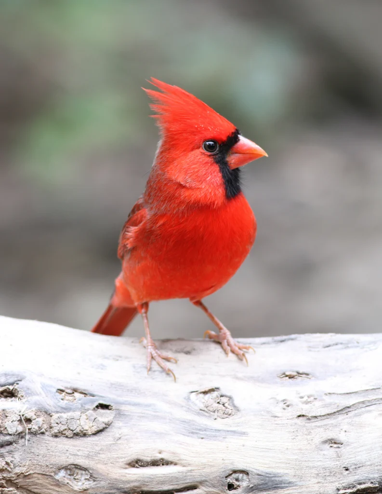
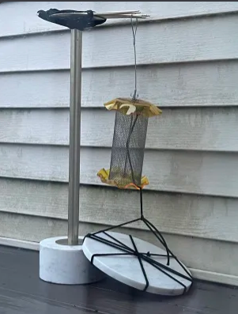
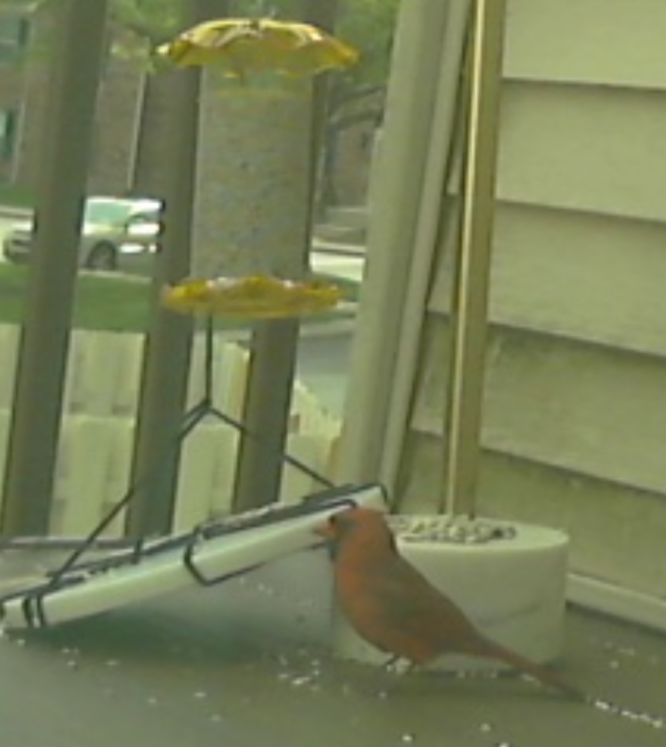
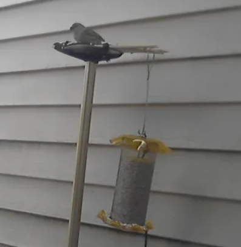

# Talon

<p align="center">
  <a href="https://github.com/reesehatfield/talon">
    
  </a>
</p>

<h3 align="center"><strong>Talon (my bird camera)</strong></h3>

<p align="center">
  Tacticle Avian Logging and Observational Network
  <br>
</p>

## What is this?
A DIY bird watcher that sends the birds to a discord server.

## Setup
You will need
- A server (Raspberry Pi or equiv. linux environment)
- USB Camera
- Renter-friendly bird feeder setup
- Glass Window
- A discord developer profile

### "Hardware":
I built a super-janky renter-friendly bird feeder setup out of a broken marble table.
The weight attached to the bottom is for ensuring the motion sensor does not trigger with the wind.




### Software:
First, you'll need to setup a Discord bot through [the Discord Developer Portal](https://discord.com/developers/applications), and add the bot to your server.
This project does not rely on any Discord-specific dependencies (e.g. `discord.py`)
Create a `.env` file and add your token to it.
```bash
touch .env
echo "TOKEN=[YOUR_TOKEN_HERE]" > .env
```
Run the project on your server with `./talon.sh`. 
This script should handle virtual environments and dependencies.

## Gallery


